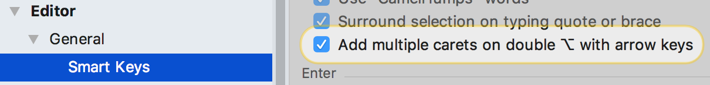
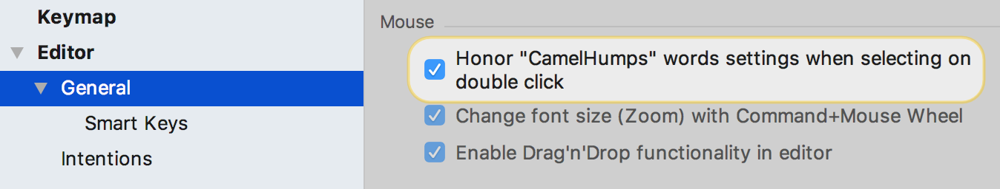
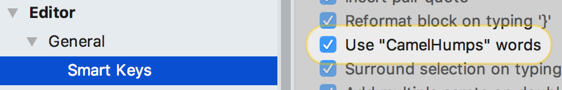
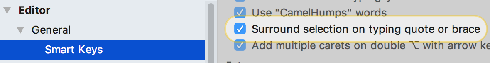
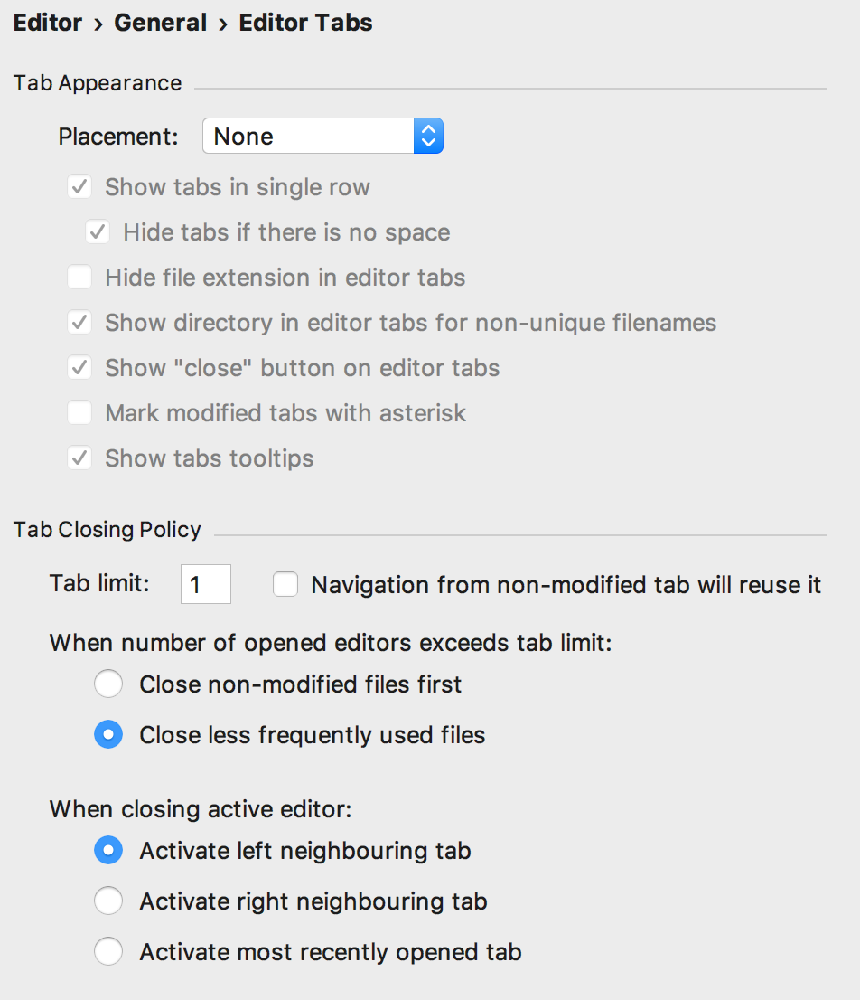
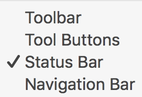
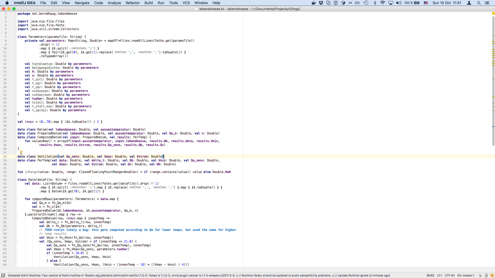
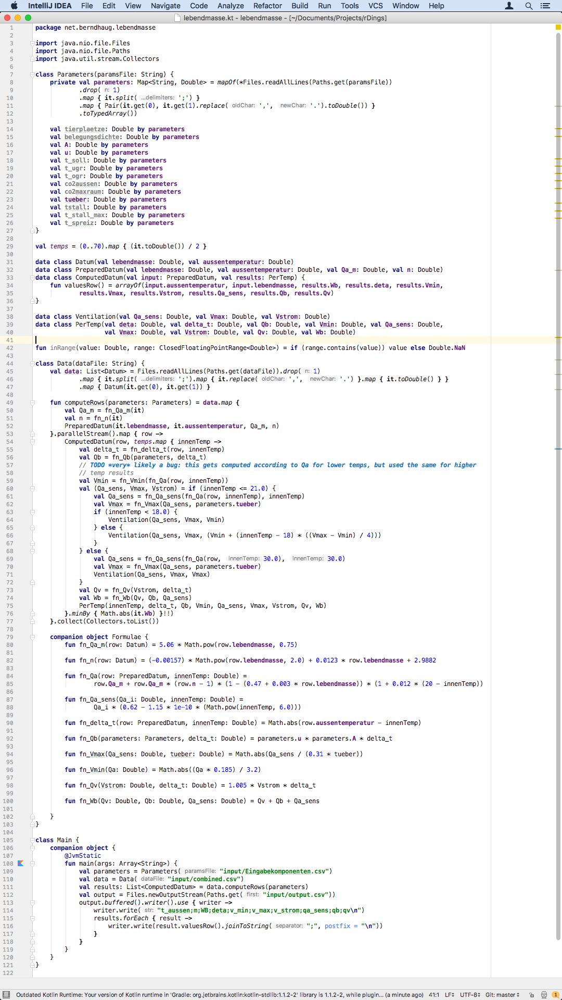

<!--
$size: 16:9
-->

---

# Caveat
## • I’m not some sort of IDEA deity
## • Most of those are just applications of
### – Talks by [@hhariri](https://www.twitter.com/hhariri) (follow highly recommended!)
### – Reading the startup “Tip of the Day” and the [IDEA Twitter](https://twitter.com/intellijidea)
### – The builtin High Score (Dropdown: Help > Productivity Guide)

---

# I. Some Settings

---

# Settings – Multi-Caret
 

## Keystroke

Place (Keyboard):
🍎 &nbsp;&nbsp;&nbsp;&nbsp;&nbsp;&nbsp;&nbsp;&nbsp;&nbsp; ⌥,⌥(hold)+⬆︎/⬇︎
🚪/🐧  &nbsp;&nbsp;&nbsp;&nbsp; ⌃, ⌃(hold)+⬆︎/⬇︎

Go back to first placed (Keyboard):
`*` &nbsp;&nbsp;&nbsp;&nbsp;&nbsp;&nbsp;&nbsp;&nbsp;&nbsp; ⎋

Place/Delete (Mouse):
`*` &nbsp;&nbsp;&nbsp;&nbsp;&nbsp;&nbsp;&nbsp;&nbsp;&nbsp; ⌥(click)

---

# Settings – Humps!

---

# Settings – Surround Selection
 

---

# Keystrokes – Expand/Shrink Selection

🍎 &nbsp;&nbsp;&nbsp;&nbsp;&nbsp;&nbsp;&nbsp;&nbsp;&nbsp; ⌥⬆︎
🚪/🐧  &nbsp;&nbsp;&nbsp;&nbsp; ⌥⬇︎

## Recently Edited Files

🍎 &nbsp;&nbsp;&nbsp;&nbsp;&nbsp;&nbsp;&nbsp;&nbsp;&nbsp; ⌃W
🚪/🐧  &nbsp;&nbsp;&nbsp;&nbsp; ⌃⇧W

- Navigation! – “Pareditish”
- Goes well with surround quotes/parens!

---

# II. Nice View

---

# Settings – No Tabs

---

# Tab Replacement

## Recent Files

🍎 &nbsp;&nbsp;&nbsp;&nbsp;&nbsp;&nbsp;&nbsp;&nbsp;&nbsp; ⌘E
🚪/🐧  &nbsp;&nbsp;&nbsp;&nbsp; ⌃E

## Recently Edited Files

🍎 &nbsp;&nbsp;&nbsp;&nbsp;&nbsp;&nbsp;&nbsp;&nbsp;&nbsp; ⌘⇧E
🚪/🐧  &nbsp;&nbsp;&nbsp;&nbsp; ⌃⇧E

---

# View dropdown – No Deadweight

- Hadi Hariri actually also recommends getting rid of the Status Bar – couldn’t do it
- Get the tool buttons back temporarily:
🍎 &nbsp;&nbsp;&nbsp;&nbsp;&nbsp;&nbsp;&nbsp;&nbsp;&nbsp; ⌘, ⌘ (hold)
🚪/🐧  &nbsp;&nbsp;&nbsp;&nbsp; ⌥, ⌥ (hold)

---

# Clean view – Manage Tool Windows Without Mouse

- In tool, back to last editor
`*` &nbsp;&nbsp;&nbsp;&nbsp;&nbsp;&nbsp;&nbsp;&nbsp;&nbsp; ⎋
- Hide current/last tool:
`*` &nbsp;&nbsp;&nbsp;&nbsp;&nbsp;&nbsp;&nbsp;&nbsp;&nbsp; ⇧⎋
- In editor, back to last tool
`*` &nbsp;&nbsp;&nbsp;&nbsp;&nbsp;&nbsp;&nbsp;&nbsp;&nbsp; [F12]
- Hide/unhide all tools
🍎 &nbsp;&nbsp;&nbsp;&nbsp;&nbsp;&nbsp;&nbsp;&nbsp;&nbsp; ⌘⇧[F12]
🚪/🐧  &nbsp;&nbsp;&nbsp;&nbsp; ⌃⇧[F12]

---

# Clean view – Open on Demand – Keystrokes

- Just learn main tools:
🍎 &nbsp;&nbsp;&nbsp;&nbsp;&nbsp;&nbsp;&nbsp;&nbsp;&nbsp; ⌘[number]
🚪/🐧  &nbsp;&nbsp;&nbsp;&nbsp; ⌥[number]
- 1 = Project view
- 7 = Structure
- 8 = Hierarchy
- 9 = Version Control

(Numbers visible on buttons!)

---

# Project Tool (#1) Alternative

- Contextual navigation; super useful!
- Lots of further actions available directly

🍎 &nbsp;&nbsp;&nbsp;&nbsp;&nbsp;&nbsp;&nbsp;&nbsp;&nbsp; ⌘⬆︎
🚪/🐧  &nbsp;&nbsp;&nbsp;&nbsp; ⌥[Home]

---

# III. Finding

---

# Search Everything
- Search Classes
🍎 &nbsp;&nbsp;&nbsp;&nbsp;&nbsp;&nbsp;&nbsp;&nbsp;&nbsp; ⌘O
🚪/🐧  &nbsp;&nbsp;&nbsp;&nbsp; ⌃N
- Search Files 
🍎 &nbsp;&nbsp;&nbsp;&nbsp;&nbsp;&nbsp;&nbsp;&nbsp;&nbsp; ⌘⇧O
🚪/🐧  &nbsp;&nbsp;&nbsp;&nbsp; ⌃⇧N
- Search Symbols (e.g. methods and functions)
🍎 &nbsp;&nbsp;&nbsp;&nbsp;&nbsp;&nbsp;&nbsp;&nbsp;&nbsp; ⌘⌥O
🚪/🐧  &nbsp;&nbsp;&nbsp;&nbsp; ⌃⌥⇧N
- Search Actions
🍎 &nbsp;&nbsp;&nbsp;&nbsp;&nbsp;&nbsp;&nbsp;&nbsp;&nbsp; ⌘⇧A
🚪/🐧  &nbsp;&nbsp;&nbsp;&nbsp; ⌃⇧A
- Search Everywhere (literally)
`*` &nbsp;&nbsp;&nbsp;&nbsp;&nbsp;&nbsp;&nbsp;&nbsp;&nbsp; ⇧, ⇧

---

# Text & Usage Search

- Not underused, but underused! `;)`
- Check the options, esp. scope!

## Search in Path

🍎 &nbsp;&nbsp;&nbsp;&nbsp;&nbsp;&nbsp;&nbsp;&nbsp;&nbsp; ⌘⇧F
🚪/🐧  &nbsp;&nbsp;&nbsp;&nbsp; ⌃⇧F

## Usage Search

`*` &nbsp;&nbsp;&nbsp;&nbsp;&nbsp;&nbsp;&nbsp;&nbsp;&nbsp; ⌥[F7]

---

# IV. Editing (Higher Level)

---

# Refactoring, Keyboard

## So, So Many Things…A Few Notes:

- Probably most used is rename (⇧[F6]): highly consistent!
  - Also works for files, change lists, packages…
- Extract variable, field, method, constant… *loves* expand selection
- Underused: Change Signature
🍎 &nbsp;&nbsp;&nbsp;&nbsp;&nbsp;&nbsp;&nbsp;&nbsp;&nbsp; ⌘[F6]
🚪/🐧  &nbsp;&nbsp;&nbsp;&nbsp; ⌃[F6]
  - also very consistent! Works e.g. for DB Tables Schema

---

# Analyze!

## Check the Available Inspections

## Can Include Some External Tools!

## A Lot Support Quick Fixes

## Underused: Fix all in File!

## Underused: “Disable Inspection for …”

- Sometimes “fixing” an inspection results in worse code!
- Just disable it!
  - Depending on situation with comment, append reasoning
  - Really important to stay at 0 warnings: “Broken window code policing”

---

# V. Other Stuff

---

# Plugins!

- *_Advanced Java Folding_*: Get Kotlinish Syntax in Java Files
  - A multi-edged hypersword
- *_Kotlin_*: OK REPL, even if you don’t use Kotlin
  - you should use Kotlin
- *_Key Promoter X_*: Productivity Guide as a nag, and a scold
  - Great fun!
- *_Regex Plugin_*: Nicer than the more-used regex test plugin
  - advanced uses like testing group match / replace

---

# Former Plugins!

- JVM memory view now core debugger feature – for debugging leaks, building mental model

---

# Printable Ref Sheet

- `Help > Keymap Reference`
- The online help in IDEA is bredy gud generally
  - Don’t skip it b/c of experience with other software!

---

# VI. Speaker’s Eccentricities

---

# Take Rat Poison

## Just turn your mouse on its back, at arm’s length
### for a day
### occasionally

---

# Another Window? Second Editor?

---

# How About “All the Code”?

